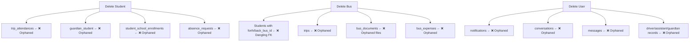

# 🗄️ Part 4: Database & Transaction Safety — سلامة قاعدة البيانات

---

## ✅ أين يتم استخدام Transactions بشكل صحيح

| العملية | الملف | Transaction? |
|---------|-------|-------------|
| Student creation | StudentController::store() | ✅ `DB::transaction()` |
| Student update | StudentController::update() | ✅ `DB::transaction()` |
| Guardian creation | StudentController::storeGuardian() | ✅ `DB::transaction()` |
| Bus creation | BusController::store() | ✅ `DB::transaction()` |
| Bus update | BusController::update() | ✅ `DB::transaction()` |
| Trip start | DailyTripApiController::startTrip() | ✅ `DB::transaction()` |
| Trip confirm | DailyTripApiController::confirmTrip() | ✅ `DB::transaction()` |
| Trip end | DailyTripApiController::endTrip() | ✅ `DB::transaction()` |
| Mark absent | DailyTripApiController::markAbsent() | ✅ `DB::transaction()` |
| Group board | DailyTripApiController::groupBoard() | ✅ `DB::transaction()` |
| Group alight | DailyTripApiController::groupAlight() | ✅ `DB::transaction()` |
| Daily trip creation | TripService::autoCreateDailyTrips() | ✅ `DB::transaction()` per bus |
| Bus assign to school | BusController::assignToSchool() | ✅ `DB::transaction()` |

> **الفريق يفهم أهمية Transactions** — هذا ممتاز.

---

## 🔴 أين تغيب Transactions (خطر فقدان بيانات)

### 1. `boardStudent()` — تسجيل ركوب طالب (عملية حرجة)

**الملف**: [DailyTripApiController.php](file:///d:/laragon/www/masarat-wasel/app/Http/Controllers/Api/DailyTripApiController.php)

```php
public function boardStudent(Request $request, Bus $bus)
{
    // 1. updateOrCreate attendance ← DB write
    $attendance = TripAttendance::updateOrCreate(
        ['trip_id' => $trip->id, 'student_id' => $student->id],
        ['status' => 'boarded', 'check_in_time' => now()]
    );
    
    // 2. Notification ← DB write + FCM API call
    $this->notificationService->notifyStudentGuardian(...);
    
    // 3. Broadcast ← WebSocket
    broadcast(new StudentStatusUpdated(...));
    
    // ⚠️ إذا فشل الإشعار بعد حفظ الـ attendance:
    // - الطالب سيظهر "على الباص" لكن ولي الأمر لن يعلم
    // - هذا ليس inconsistency في الـ DB لكنه inconsistency في الـ UX
}
```

### 2. `alightStudent()` — تسجيل نزول طالب

**نفس المشكلة** — بدون transaction.

### 3. `notifyNearHouse()` — إشعار بجوار المنزل

```php
public function notifyNearHouse(Request $request, Bus $bus)
{
    // 1. updateOrCreate attendance → status = 'waiting' ← DB write
    TripAttendance::updateOrCreate(..., ['status' => 'waiting']);
    
    // 2. Push notification ← DB write + FCM
    $this->notificationService->notifyStudentGuardian(...);
    
    // 3. Broadcast ← WebSocket
    // ⚠️ بدون transaction — إذا فشل step 2/3 الحالة تتغير بدون إشعار
}
```

### 4. Student Deletion

**الملف**: [StudentController.php:436-443](file:///d:/laragon/www/masarat-wasel/app/Http/Controllers/School/StudentController.php#L436-L443)
```php
public function destroy(Student $student)
{
    $this->authorize('delete', $student);
    $student->delete();
    // ⚠️ ماذا عن:
    // - trip_attendances المرتبطة؟
    // - guardian_student pivot؟
    // - enrollments؟
    // - absence_requests؟
    // ← لا cascading delete ولا soft delete!
}
```

### 5. Bus Archive

```php
public function archive(Request $request, Bus $bus)
{
    $bus->update([
        'status' => 'out_of_service',
        'deactivation_reason' => $request->deactivation_reason
    ]);
    $bus->delete(); // soft delete
    // ⚠️ ماذا عن الطلاب المرتبطين بهذا الباص؟
    // - forth_bus_id / back_bus_id لن يُلغوا
    // - الطلاب سيبقون مرتبطين بباص محذوف
}
```

### 6. Conversation Creation — startConversation()

```php
$conversation = Conversation::create([...]);
$conversation->participants()->attach([...]); 
// ⚠️ بدون transaction — يمكن أن تُنشأ محادثة بدون مشاركين
```

---

## 🟠 Mass Assignment Gaps

### Student Model
```php
protected $fillable = [
    'first_name_ar', 'second_name_ar', ...,
    'is_active',        // ⚠️ يجب أن لا يكون fillable — أمني
    'forth_bus_id',      // ✅ مطلوب
    'back_bus_id',       // ✅ مطلوب
    'latitude',          // ⚠️ يجب أن يكون عبر API مخصص
    'longitude',         // ⚠️ يجب أن يكون عبر API مخصص
];
```

### Bus Model
```php
protected $fillable = [
    'bus_number',        // ⚠️ يُولّد تلقائياً — لا يجب أن يكون fillable
    'status',            // ⚠️ يجب أن يتغير فقط عبر methods مخصصة
    'latitude',          // ⚠️ يجب أن يكون عبر GPS API فقط
    'longitude',         // ⚠️ يجب أن يكون عبر GPS API فقط
];
```

---

## 🟠 Cascade Delete Issues

### ماذا يحدث عند حذف كل entity:



### ✅ الحل المقترح:
```php
// Option 1: Foreign Key Cascading في Migrations
$table->foreignId('student_id')
    ->constrained()
    ->onDelete('cascade'); // أو 'set null'

// Option 2: Model Events (أفضل للـ soft deletes)
protected static function boot()
{
    parent::boot();
    static::deleting(function ($student) {
        $student->tripAttendances()->delete();
        $student->enrollments()->delete();
        $student->guardians()->detach();
        $student->absenceRequests()->delete();
    });
}

// Option 3: استخدم Soft Deletes بدل Hard Delete
class Student extends Model
{
    use SoftDeletes; // ← الأفضل لنظام مدرسي
}
```

---

## 🟡 Data Integrity Gaps

### 1. عدم وجود Unique Constraints على Composite Keys

```sql
-- trip_attendances: يمكن إنشاء سجلين لنفس الطالب في نفس الرحلة!
-- ⚠️ updateOrCreate يحمي من هذا programmatically لكن NOT on DB level
ALTER TABLE trip_attendances 
ADD CONSTRAINT unique_trip_student UNIQUE (trip_id, student_id);

-- guardian_student: يمكن ربط نفس ولي الأمر بنفس الطالب مرتين
ALTER TABLE guardian_student 
ADD CONSTRAINT unique_guardian_student UNIQUE (guardian_id, student_id);

-- trips: يمكن إنشاء رحلتين من نفس النوع لنفس الباص في نفس اليوم
ALTER TABLE trips 
ADD CONSTRAINT unique_bus_type_date UNIQUE (bus_id, type, trip_date);
```

### 2. عدم وجود CHECK Constraints

```sql
-- Trip status must be valid
ALTER TABLE trips ADD CONSTRAINT chk_trip_status 
CHECK (status IN ('pending', 'awaiting_confirmation', 'in_progress', 'finished', 'cancelled'));

-- Attendance status must be valid
ALTER TABLE trip_attendances ADD CONSTRAINT chk_attendance_status 
CHECK (status IN ('absent', 'excused', 'waiting', 'boarded', 'dropped'));

-- Bus capacity must be positive
ALTER TABLE buses ADD CONSTRAINT chk_bus_capacity 
CHECK (capacity > 0 AND capacity <= 100);
```

### 3. Time Consistency Issues

```php
// In endTrip() — video stored, trip marked as finished
// But if connection drops between video upload and DB update...
$path = $request->file('video')->store("trip_videos/{$dateFolder}", 'public');
// ← File saved to disk

DB::transaction(function () use ($trip, $bus, $path, $tripType) {
    $trip->update(['video_path' => $path, ...]);
    // ← If this fails, we have an orphaned video file
});
```

---

## 📊 ملخص Transactions المطلوبة

| العملية | الحالة | الأولوية |
|---------|--------|---------|
| boardStudent() | ❌ Missing | 🔴 Critical |
| alightStudent() | ❌ Missing | 🔴 Critical |
| notifyNearHouse() | ❌ Missing | 🟠 High |
| Student deletion | ❌ No cascade | 🟠 High |
| Bus archive | ❌ No cleanup | 🟠 High |
| startConversation() | ❌ Missing | 🟡 Medium |
| DB-level unique constraints | ❌ Missing | 🟠 High |
| CHECK constraints | ❌ Missing | 🟡 Medium |
