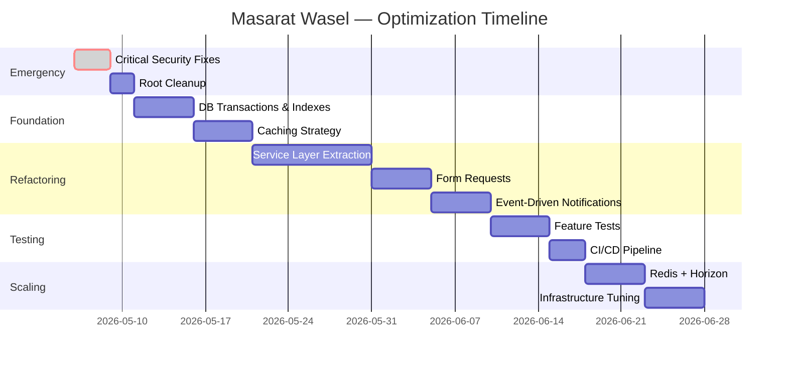

# 🗺️ Part 5: Optimization Roadmap — خارطة طريق التحسين

> هذا المستند يحدد **خطة عمل واقعية** لتحويل المشروع من **Prototype → Production → Enterprise** مع جدول زمني وأولويات واضحة.

---

## المرحلة الأولى: 🚨 Emergency Fixes (أسبوع واحد)

> **الهدف**: إصلاح الثغرات الأمنية وإزالة مخاطر فقدان البيانات.
> **الشرط**: لا يتم إطلاق النظام لأي مستخدم جديد قبل إتمام هذه المرحلة.

### Week 1 — Critical Security & Stability

| # | المهمة | الملف | الجهد |
|---|--------|-------|-------|
| 1 | حذف `dd()` من StudentController | StudentController.php:374 | 5 min |
| 2 | تقييد Google Maps API Key | Google Cloud Console | 15 min |
| 3 | إصلاح `env()` → `config()` | GoogleMapsService.php | 10 min |
| 4 | حذف/تأمين SystemCommandController | SystemCommandController.php | 30 min |
| 5 | حذف test routes من web.php | web.php:34-186 | 30 min |
| 6 | إضافة Rate Limiting للـ API | api.php + RouteServiceProvider | 1 hour |
| 7 | إصلاح FCM token saving | AuthController.php | 30 min |
| 8 | تنظيف Root directory | 30+ files | 1 hour |
| 9 | إضافة `.gitignore` entries | .gitignore | 15 min |
| 10 | تقوية Password Policy | AuthController.php | 15 min |

**Total: ~5 ساعات عمل**

---

## المرحلة الثانية: 🏗️ Foundation Hardening (أسبوعين)

> **الهدف**: بناء الأساسات الصلبة: transactions, indexes, caching, error handling.

### Week 2 — Database Safety

| # | المهمة | الأثر |
|---|--------|-------|
| 1 | إضافة `DB::transaction()` لـ boardStudent, alightStudent, notifyNearHouse | يمنع data inconsistency |
| 2 | إضافة Soft Deletes لـ Student model | يمنع فقدان بيانات تاريخية |
| 3 | إضافة cascade/cleanup لحذف Student, Bus, User | يمنع orphaned records |
| 4 | إضافة Unique Constraints على DB level | يمنع duplicate records |
| 5 | إضافة Missing Indexes (6 indexes) | يحسن performance 5-10x |
| 6 | Migration: CHECK constraints للـ status fields | يمنع invalid data |

```php
// Migration مقترح: add_missing_indexes.php
Schema::table('students', function ($table) {
    $table->index(['forth_bus_id', 'is_active']);
    $table->index(['back_bus_id', 'is_active']);
});

Schema::table('trip_attendances', function ($table) {
    $table->unique(['trip_id', 'student_id']);
});

Schema::table('trips', function ($table) {
    $table->unique(['bus_id', 'type', 'trip_date']);
});

Schema::table('buses', function ($table) {
    $table->index(['school_id', 'status']);
});
```

### Week 3 — Caching & Performance

| # | المهمة | الأثر |
|---|--------|-------|
| 1 | تغيير CACHE_STORE إلى `file` أو `redis` | يقلل حمل DB |
| 2 | كاشينغ notification count في HandleInertiaRequests | يوفر 2 queries/request |
| 3 | كاشينغ User::getSchoolId() | يوفر 3-5 queries/request |
| 4 | كاشينغ Analytics KPIs (5 min TTL) | يوفر 50+ queries/load |
| 5 | استخدام FCM Multicast بدل loop | يقلل وقت الإشعار 90% |
| 6 | كاشينغ ChatController contacts | يوفر 10-15 queries/request |

```php
// في .env
CACHE_STORE=redis  // أو file
SESSION_DRIVER=cookie
QUEUE_CONNECTION=redis  // أو database مؤقتاً
```

---

## المرحلة الثالثة: 🏛️ Architecture Refactoring (3-4 أسابيع)

> **الهدف**: فصل المسؤوليات وجعل الكود قابلاً للاختبار والصيانة.

### Week 4-5 — Service Layer Extraction

```
📁 app/Services/ (الحالي → المطلوب)
├── TripService.php           ✅ موجود
├── NotificationService.php   ✅ موجود (يحتاج تحسين)
├── GoogleMapsService.php     ✅ موجود
├── SubscriptionService.php   ✅ موجود
├── AttendanceService.php     🆕 استخراج من DailyTripApiController
├── BusManagementService.php  🆕 استخراج من BusController
├── StudentService.php        🆕 استخراج من StudentController
├── AnalyticsService.php      🆕 استخراج من AnalyticsController
├── ChatService.php           🆕 استخراج من ChatController
├── DriverService.php         🆕 استخراج من multiple controllers
└── AuditService.php          🆕 System event logging
```

**المعيار**: كل Controller method ≤ 25 سطر — يستدعي Service ويرجع Response فقط.

```php
// مثال: DailyTripApiController بعد الـ Refactoring
class DailyTripApiController extends Controller
{
    public function __construct(
        protected AttendanceService $attendanceService,
        protected NotificationService $notificationService
    ) {}

    public function boardStudent(BoardStudentRequest $request, Bus $bus)
    {
        $result = $this->attendanceService->boardStudent(
            bus: $bus,
            studentId: $request->student_id,
            userId: $request->user()->id
        );

        return response()->json($result->toArray(), $result->statusCode());
    }
}
```

### Week 5-6 — Form Requests

```
📁 app/Http/Requests/ (المطلوب)
├── Admin/
│   ├── StoreBusRequest.php
│   ├── UpdateBusRequest.php
│   ├── StoreDriverRequest.php
│   ├── StoreRouteRequest.php
│   └── StoreFieldTripRequest.php
├── School/
│   ├── StoreStudentRequest.php
│   ├── UpdateStudentRequest.php
│   └── StoreGuardianRequest.php
├── Api/
│   ├── LoginRequest.php
│   ├── BoardStudentRequest.php
│   ├── AlightStudentRequest.php
│   ├── MarkAbsentRequest.php
│   ├── EndTripRequest.php
│   └── SendMessageRequest.php
```

### Week 6-7 — Observer & Event System

```php
// بدلاً من notification logic في Controllers:
// Event-driven architecture

// 1. Events
StudentBoarded::class         → NotifyGuardianListener
StudentAlighted::class        → NotifyGuardianListener
TripStarted::class            → NotifyAllGuardiansListener
BusNearHouse::class           → NotifySpecificGuardianListener
TripFinished::class           → NotifyCrewListener + AnalyticsListener

// 2. Queued Listeners (async)
class NotifyGuardianListener implements ShouldQueue
{
    public function handle(StudentBoarded $event)
    {
        $this->notificationService->notifyStudentGuardian(
            $event->student->id,
            'bus_boarding',
            ...
        );
    }
}
```

---

## المرحلة الرابعة: 🧪 Testing & CI/CD (أسبوعين)

> **الهدف**: 80%+ test coverage على الـ Business Logic الحرج.

### Week 7 — Feature Tests

```
📁 tests/Feature/
├── Auth/
│   ├── LoginTest.php           → Login/Logout flows
│   └── PasswordChangeTest.php  → Password rules
├── Trip/
│   ├── BoardStudentTest.php    → Golden path + edge cases
│   ├── AlightStudentTest.php   → Status transitions
│   ├── StartTripTest.php       → Trip lifecycle
│   ├── EndTripTest.php         → Video verification
│   └── GroupBoardTest.php      → Bulk operations
├── Student/
│   ├── CreateStudentTest.php   → Validation + DB integrity
│   └── DeleteStudentTest.php   → Cascade behavior
└── Notification/
    └── NotificationServiceTest.php → FCM + DB
```

### Week 8 — CI/CD Pipeline

```yaml
# .github/workflows/ci.yml
name: CI Pipeline

on: [push, pull_request]

jobs:
  test:
    runs-on: ubuntu-latest
    services:
      postgres:
        image: postgres:16
    steps:
      - uses: actions/checkout@v4
      - name: Setup PHP
        uses: shivammathur/setup-php@v2
        with:
          php-version: '8.2'
      - run: composer install --no-interaction
      - run: php artisan test
      - run: npm ci && npm run build
```

---

## المرحلة الخامسة: 🚀 Scaling to 10,000+ Users (مستمر)

### Infrastructure

| المكوّن | الحالي | المطلوب |
|---------|--------|---------|
| **Web Server** | Single Laragon | Nginx + Load Balancer |
| **Database** | Single PostgreSQL | Primary + Read Replica |
| **Cache** | Database | Redis Cluster |
| **Queue** | Database | Redis + Horizon Dashboard |
| **Search** | LIKE queries | Meilisearch / Algolia |
| **Storage** | Local disk | S3 / CloudFlare R2 |
| **Monitoring** | Error logs | Laravel Telescope + Sentry |
| **CDN** | None | CloudFlare |

### Database Scaling Strategy

```sql
-- 1. Partitioning for trips table (grows fastest)
CREATE TABLE trips_2026 PARTITION OF trips
FOR VALUES FROM ('2026-01-01') TO ('2027-01-01');

-- 2. Archive old data
-- Move trip_attendances older than 6 months to archive table
INSERT INTO trip_attendances_archive SELECT * FROM trip_attendances
WHERE created_at < NOW() - INTERVAL '6 months';

-- 3. Materialized Views for analytics
CREATE MATERIALIZED VIEW mv_daily_kpis AS
SELECT 
    trip_date,
    COUNT(*) as total_trips,
    SUM(CASE WHEN status = 'finished' THEN 1 ELSE 0 END) as completed,
    ...
GROUP BY trip_date;
```

### Queue Strategy

```php
// تصنيف الـ Jobs حسب الأولوية
// High priority: real-time notifications
// Medium: analytics updates
// Low: reports generation, cleanup

// config/horizon.php
'environments' => [
    'production' => [
        'realtime' => [
            'connection' => 'redis',
            'queue' => ['notifications', 'broadcasts'],
            'balance' => 'auto',
            'processes' => 4,
        ],
        'default' => [
            'connection' => 'redis',
            'queue' => ['default', 'analytics'],
            'balance' => 'auto',
            'processes' => 2,
        ],
    ],
],
```

---

## 🛠️ Professional Tooling Recommendations

### أدوات مطلوبة فوراً

| الأداة | الاستخدام | الأولوية |
|--------|-----------|---------|
| **Laravel Telescope** | Debug + Query monitoring | 🔴 فوراً |
| **Sentry** | Error tracking في Production | 🔴 فوراً |
| **Laravel Horizon** | Queue monitoring | 🟠 بعد Redis |
| **Laravel Pint** | Code formatting | 🟡 Week 2 |
| **PHPStan / Larastan** | Static analysis | 🟡 Week 3 |
| **Pest PHP** | Modern testing | 🟡 Week 7 |

### أدوات مفيدة للمستقبل

| الأداة | الاستخدام |
|--------|-----------|
| **Spatie Permission** | بديل لنظام الصلاحيات الحالي — أنضج وأقوى |
| **Spatie Activity Log** | بديل لـ SystemEventLog — audit trail شامل |
| **Spatie Media Library** | إدارة الملفات بشكل احترافي |
| **Meilisearch** | بحث سريع (بديل لـ LIKE queries) |
| **Laravel Octane** | مضاعفة الأداء 2-4x |

---

## 📊 الجدول الزمني الكامل



---

## 📈 الأثر المتوقع

| المعيار | الآن | بعد Phase 1-2 | بعد Phase 3-5 |
|---------|------|--------------|--------------|
| **Security Score** | 3/10 | 8/10 | 9/10 |
| **Performance (queries/page)** | 50-70 | 10-15 | 3-5 |
| **Response Time** | 800ms-3s | 200-500ms | 50-150ms |
| **Max Concurrent Users** | ~100 | ~1,000 | ~10,000+ |
| **Test Coverage** | 0% | 0% | 80%+ |
| **Maintainability Score** | 4/10 | 6/10 | 9/10 |
| **MTTR (Mean Time to Resolve)** | Hours | Minutes | Minutes |

---

## 🎯 الخلاصة النهائية

> **المشروع لديه أساس متين** — التقنيات المختارة ممتازة، بنية قاعدة البيانات جيدة، والفريق يفهم مبادئ الأمان الأساسية (Transactions, Authorization).
>
> **المشكلة الرئيسية** هي أن المشروع نما بسرعة أكبر من البنية — مما أدى لتراكم Technical Debt في:
> 1. Controllers مثقلة بالـ Business Logic
> 2. عدم وجود Caching strategy
> 3. ثغرات أمنية مكشوفة (test routes, dd(), SystemCommand)
> 4. عدم وجود Tests بالمطلق
>
> **بتطبيق هذه الخطة**: المشروع سيتحول من **Working Prototype** إلى **Enterprise-Grade System** خلال **8-10 أسابيع** من العمل المركّز.

---

> [!TIP]
> **التوصية الذهبية**: ابدأ بـ **Phase 1 (Emergency Fixes)** اليوم. لا تتجاوزها. يمكنك العمل على Phase 2 بالتوازي مع ميزات جديدة، لكن Phase 1 يجب أن تُنجز **قبل أي إطلاق عام**.
